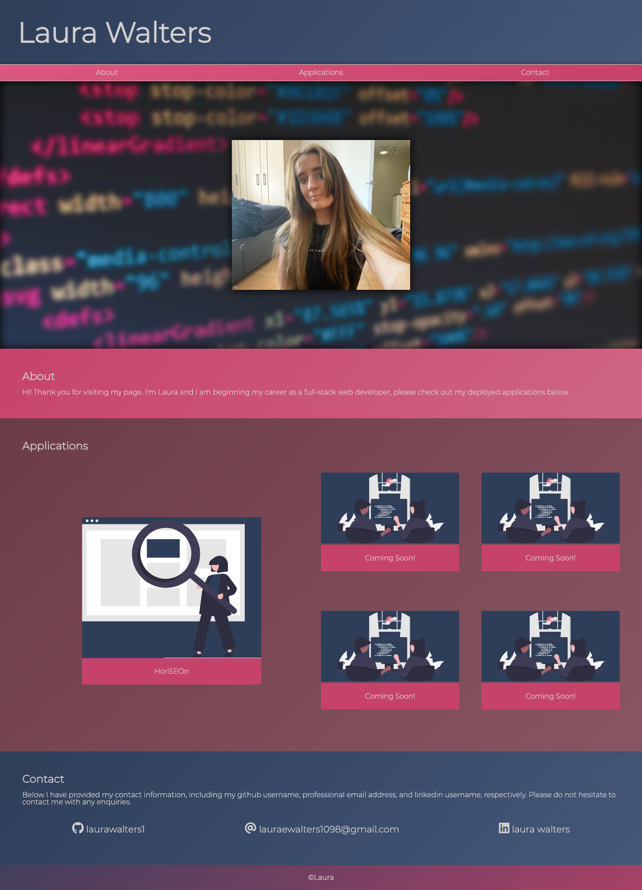

# portfolio

This is my current portfolio where I will display all my deployed applications for potential employers to view. It currently contains my previous debugging homework, as well as 4 place holder cards which will soon contain further applications.
The page is responsive, and interactive in the desktop view, as well as functional in both desktop and mobile view, with ‘jump to’ links in the nav-bar, and links to my applications/coming soon pages, as well as my github, linkedin and email.
When I am proficient in javascript, I plan to use the viewport height to implement scroll effects to make the page feel more dynamic and interactive in a mobile view, I will do this by scaling up elements when they are optimally positioned on the screen and scaling down when they are scrolled past.
I will also use javascript to make the entire div container of my deployed applications clickable with the effect of activating relevant anchor tag to improve user experience.
Finally I will use javascript to create a hamburger nav bar in the mobile view which will sit in the header which will then be fixed, so that it is always accessible  regardless of the position of the viewport on the page.

https://laurawalters1.github.io/portfolio/
